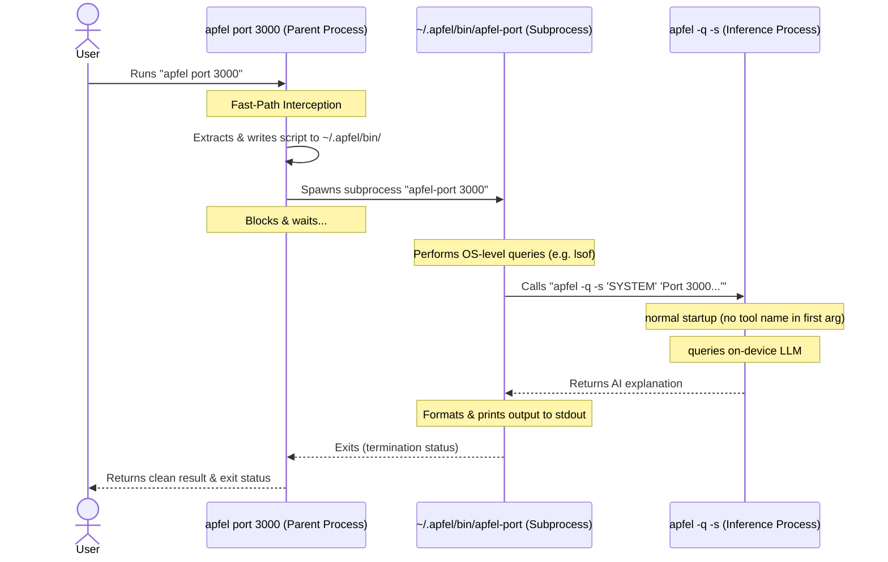

# Demos

`apfel` ships with real shell wrappers in `demo/`. This page keeps the longer walkthroughs that used to live in `README.md`; the quicker per-script overview stays in [../demo/README.md](../demo/README.md).

## [../demo/cmd](../demo/cmd)

Natural language to shell command:

```bash
demo/cmd "find all .log files modified today"
# $ find . -name "*.log" -type f -mtime -1

demo/cmd -x "show disk usage sorted by size"   # -x = execute after confirm
demo/cmd -c "list open ports"                  # -c = copy to clipboard
```

### Shell function version

Add this to your `.zshrc` and use `cmd` from anywhere:

```bash
# cmd - natural language to shell command (apfel). Add to .zshrc:
cmd(){ local x c r a; while [[ $1 == -* ]]; do case $1 in -x)x=1;shift;; -c)c=1;shift;; *)break;; esac; done; r=$(apfel -q -s 'Output only a shell command.' "$*" | sed '/^```/d;/^#/d;s/\x1b\[[0-9;]*[a-zA-Z]//g;s/^[[:space:]]*//;/^$/d' | head -1); [[ $r ]] || { echo "no command generated"; return 1; }; printf '\e[32m$\e[0m %s\n' "$r"; [[ $c ]] && printf %s "$r" | pbcopy && echo "(copied)"; [[ $x ]] && { printf 'Run? [y/N] '; read -r a; [[ $a == y ]] && eval "$r"; }; return 0; }
```

```bash
cmd find all swift files larger than 1MB
cmd -c show disk usage sorted by size
cmd -x what process is using port 3000
cmd list all git branches merged into main
cmd count lines of code by language
```

## [../demo/oneliner](../demo/oneliner)

Complex pipe chains from plain English:

```bash
demo/oneliner "sum the third column of a CSV"
# $ awk -F',' '{sum += $3} END {print sum}' file.csv

demo/oneliner "count unique IPs in access.log"
# $ awk '{print $1}' access.log | sort | uniq -c | sort -rn
```

## [../demo/mac-narrator](../demo/mac-narrator)

Your Mac's inner monologue:

```bash
demo/mac-narrator
demo/mac-narrator --watch
```

## Also In `demo/`

- [../demo/wtd](../demo/wtd) - "what's this directory?" project orientation
- [../demo/explain](../demo/explain) - explain a command, error, or code snippet
- [../demo/naming](../demo/naming) - naming suggestions for functions, variables, and files
- [../demo/port](../demo/port) - identify what is using a port
- [../demo/gitsum](../demo/gitsum) - summarize recent git activity

---

## Architecture & Execution Lifecycle

The premium developer tools (`cmd`, `oneliner`, `naming`, `explain`, `wtd`, `port`, `process`, `daemon`, `docs-apple`, `mdn`) are designed as a hybrid system: high-level OS querying is managed in lightweight bash scripts, while AI reasoning is handled by the compiled `apfel` binary.

All 10 tool scripts are embedded directly inside the compiled `apfel` binary as raw resources.

### Invocation Syntax

| Context | Syntax | Example |
|---------|--------|---------|
| Terminal (single-mode) | bare first word | `apfel port 3000` |
| Interactive chat (`--chat`) | slash prefix | `you› /port 3000` |

In **chat mode**, the `/` prefix is required. This prevents false positives: typing `port is an important concept` sends that sentence to the LLM, while `/port 3000` runs the port tool. Bare words in chat always go to the model.

**Session controls** follow the same slash protocol:
- `/clear` — erase the terminal screen, conversation context kept
- `/new` — erase screen and reset to a completely fresh session
- `/context` — print current context-window usage

### Step-by-Step Execution Flow

When you execute a tool like `apfel port 3000` (or `/port 3000` in chat), the following lifecycle occurs:



1. **Fast-Path Interception**:
   The parent `apfel` process inspects the first argument. Seeing `port` (or `/port` in chat after stripping the slash), it bypasses model loading entirely and runs instantly.
2. **Extraction & Launch**:
   The parent auto-creates `~/.apfel/bin/` if missing, extracts the raw `apfel-port` bash script from its compiled database, marks it executable, and spawns a subprocess. The parent blocks and waits.
3. **Local OS Gathering**:
   The bash script performs lightweight local operations (e.g., `lsof -i :3000` to find listening PIDs).
4. **LLM Querying (No Recursion)**:
   The script calls `apfel -q -s "..."` to request AI reasoning. Because the first argument is `-q` (not a tool name like `port`), this second `apfel` instance skips fast-path interception entirely, loads the local Apple Intelligence model, generates the explanation, and returns — no recursion loop.
5. **Output Delivery**:
   The script formats the response and prints it to your terminal, then exits. In chat mode, the parent re-injects both the slash command and the tool output into the session transcript so the model can reference the result in follow-up questions.

### Argument Parsing: Quoting & Dispatch

Arguments pass through three layers before reaching the tool script. Shell quoting determines how they split at each boundary.

#### Layer 1: `main.swift` fast-path interception

The first `argv` entry is inspected. If its first word is a tool name, the fast-path fires:

```bash
apfel docs-apple SwiftUI Button          # argv = ["docs-apple", "SwiftUI", "Button"]
                                         #   → firstArg word "docs-apple" → matched
                                         #   → toolArgs = ["SwiftUI", "Button"]

apfel "docs-apple SwiftUI Button"        # argv = ["docs-apple SwiftUI Button"]
                                         #   → split internally → same 3-word detection
                                         #   → rawArgs.count == 1, so toolArgs = ["SwiftUI", "Button"]

apfel docs-apple "SwiftUI Button"        # argv = ["docs-apple", "SwiftUI Button"]
                                         #   → rawArgs.count == 2, so toolArgs = ["SwiftUI Button"]
```

All three forms produce identical results — the query words reach the script the same way.

#### Layer 2: `runDeveloperTool` flag/query split

Leading tokens that start with `-` are routed as flags; everything else joins into a single query string:

```bash
apfel docs-apple -c SwiftUI Button       # → procArgs = ["-c", "SwiftUI Button"]
apfel docs-apple --copy SwiftUI Button   # → procArgs = ["--copy", "SwiftUI Button"]
apfel docs-apple --3000 SwiftData        # → procArgs = ["--3000", "SwiftData"]
apfel docs-apple --no-sosumi SwiftUI Button # → procArgs = ["--no-sosumi", "SwiftUI Button"]
```

For `docs-apple`, numeric flags such as `--1000`, `--2000`, and `--3000` set the approximate documentation-context token budget. The default is `--2000`. Fetched Sosumi/native Markdown is pruned structurally before apfel sees it: navigation-heavy sections such as `Inherited By`, `Conforms To`, `Conforming Types`, `Relationships`, and `See Also` are dropped first; high-value sections such as `Overview`, `Declaration`, `Discussion`, `Parameters`, `Creating`, and `Using` are prioritized.

#### Layer 3: docs-first grounding (`docs-apple` specific)

The `docs-apple` script whitespace-splits multi-word arguments, cleans quotes and punctuation, then scans **every word** for useful Apple documentation hints. It always tries to search/fetch Apple docs before falling back to model-only knowledge.

**Framework detection:** any cleaned word matching an Apple documentation framework slug sets the framework. The list includes common slugs such as `swift`, `swiftui`, `swiftdata`, `foundationmodels`, `combine`, `coredata`, `mapkit`, `vision`, `widgetkit`, `storekit`, and many more. The first match wins. Multi-word spellings are compacted too: `Swift Data` → `swiftdata`, `Foundation Models` → `foundationmodels`.

**Intent words:** words such as `explain`, `what`, `how`, `why`, `show`, `tell`, `overview`, `summarize`, `summary`, and `describe` are not a switch to model-only mode. They only help apfel understand the user is asking a prose question, and they are filtered out when building the probable Apple docs search query.

**Explicit `@keyword` control:** prefix any word with `@` to force it as the exact Apple docs search term. This bypasses auto-detection and stop-word filtering entirely. `@` has no special shell meaning, so this works unquoted in both terminal and chat mode.

```bash
/docs-apple @CoreData
/docs-apple @SwiftUI @NavigationSplitView
/docs-apple explain @NetworkExtension in a few sentences
/docs-apple @WidgetKit how to build a widget
```

`@keyword` detection runs before auto-detection. If any `@keyword` tokens are present, they are joined with spaces and used as the Apple docs search query directly.

**Grounding order** (highest to lowest priority):

| Detected hints | First attempt | Fallbacks |
|----------------|---------------|-----------|
| `@keyword` tokens present | Use `@keyword` directly as Apple docs search/fetch query | No fallback — user intent is explicit |
| Framework + symbol | Apple docs search for `framework symbol` | Direct `framework/symbol`, then raw query search |
| Symbol only | Apple docs search for `symbol` | Direct candidate-framework fetches, then raw query search |
| Framework only | Apple docs search for `framework` | Framework-root fetch, then raw query search |
| No clear hint | Apple docs search for cleaned user query | Direct heuristics if any emerge, then model-only fallback |

**Example traces:**

```bash
explain in few sentences Combine framework
  → "Combine" found anywhere → framework hint: combine
  → probable docs query: combine
  → search Apple docs for combine, fetch best result

explain "SwiftData"
  → quotes stripped → SwiftData becomes swiftdata
  → probable docs query: swiftdata
  → search Apple docs for swiftdata, fetch best result

explain Combine Publisher
  → framework hint: combine, symbol hint: publisher
  → probable docs query: combine publisher
  → search Apple docs, fetch best result; direct combine/publisher fetch is fallback

SwiftUI Button
  → framework hint: swiftui, symbol hint: button
  → search Apple docs for swiftui button, fetch best result

SwiftUI "Button"
  → quotes stripped before SYMBOL construction
  → search Apple docs for swiftui button, not swiftui "button"

Button SwiftUI
  → framework hint: swiftui, symbol hint: button
  → search Apple docs for swiftui button. Works with words in any order.

Combine framework explain in few sentences
  → framework hint: combine
  → probable docs query: combine
  → search Apple docs, fetch best result

Task
  → symbol hint: task
  → search Apple docs for task, fetch best result; candidate-framework fetches are fallback
```

`CANDIDATE_FRAMEWORKS` and `COMMON_SYMBOLS` are hint lists, not gates. They help apfel build a focused Apple docs search query and provide direct-fetch fallbacks if search fails. `INTENT_WORDS` helps apfel remove prose words such as `explain` from the docs query. Model-only answering is the final fallback.

#### Layer 4: MDN Web Docs search (`mdn` specific)

The `mdn` script searches Mozilla Developer Network Web Docs and returns trimmed documentation for the top result. It is optimized for HTML, CSS, JavaScript, and Web API questions.

**Search flow:**
1. Search the MDN API (`api/v1/search`) with the query
2. Select the top-ranked result
3. Fetch the full doc JSON (`{path}/index.json`)
4. Extract title, summary, and prose body sections
5. Drop specifications, browser compatibility tables, and see-also links
6. Trim to a character budget (default 1000 chars)

**Budget flags:**
- `--1000` — default (~250 tokens)
- `--2000` — double (~500 tokens)
- `--3000` — triple (~750 tokens)

**Explicit `@keyword` control:** prefix any word with `@` to force it as the exact MDN search term.

```bash
/mdn CSS flexbox
/mdn @flexbox
/mdn --2000 Array.prototype.map
/mdn --3000 @closures
/mdn @fetch @API
```

#### Chat mode: `/` prefix dispatch

`ChatCommand.parse` strips the leading `/`, treats double quotes as grouping markers, then joins non-flag words into one query string. Double quotes are stripped before dispatch; single quotes are preserved so shell snippets keep their meaning:

```
you› /docs-apple Combine framework explain in few sentences
     → tool(name: "docs-apple", args: ["Combine framework explain in few sentences"])
     → script receives one arg, whitespace-splits → layers 3+ above apply

you› /docs-apple --3000 SwiftData
     → toolArgs = ["--3000", "SwiftData"]
     → fetched docs are pruned to ~3000 tokens before apfel sees them

you› /docs-apple --1000 explain "SwiftData"
     → toolArgs = ["--1000", "explain \"SwiftData\""]
     → quotes stripped, intent detected, SwiftData docs searched/fetched, budget ~1000 tokens

you› /docs-apple -c Combine Publisher
     → toolArgs = ["-c", "Combine Publisher"]
     → BLOCKED: -c/--copy is disabled in chat mode
```

**Why `-c` and `-x` are blocked in chat mode.** The chat handler rejects `-x`/`--execute` and `-c`/`--copy`. Run those directly from the shell:
```bash
apfel docs-apple -c Combine Publisher
apfel cmd -x "show disk usage"
```
